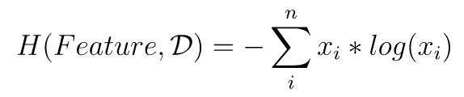

# information-theory

This repository consists of Python scrips for calculating information theory metrics and functions. There is no claim of mathematical identity to the functions, but they could be used as helper functions for studying information theory or reused in code for Machine Learning algorithms.

In the following functions are classified by the area of information theory they target. Every module covers one part of information theory that we use for our machine learning classes.

## entropy.py
The `entropy` module covers concepts such as entropy, information gain, etc. Here is how to use the different functions.

### entropy(list)
The `entropy` function takes a list of probabilities and uses it to calculate entropy for a descriptive feature or overall entropy for a target. A list `x` would be used as follows: . The output of the function the raw entropy value as float.

### ig(DataFrame)
The `ig` (information gain) function takes a [pandas](https://pandas.pydata.org/) `DataFrame` with the following format:

| Descriptive Feature 1 | Descriptive Feature 2 | ... | Descriptive Feature n | Target Feature |
| ----------------------|-----------------------|-----|-----------------------|--------------- |
| random category       | random category       | ... | random category       | random category|
| ...                   | ...                   | ... | ...                   | ...            |

The code will count all categories and use the `entropy` function as helper. The output of this function will have be a `DataFrame` again, as follows:

| feature   | IG    |
| --------- | ----- |
| feature 1 | float |
| ...       | ...   |
| feature n | float |

## How to run the code
To run the code, simply import `entropy.py` with `import(entropy)` (it has to be in your working directory). When you want to call one of the functions, use `entropy.[function_name]`.
